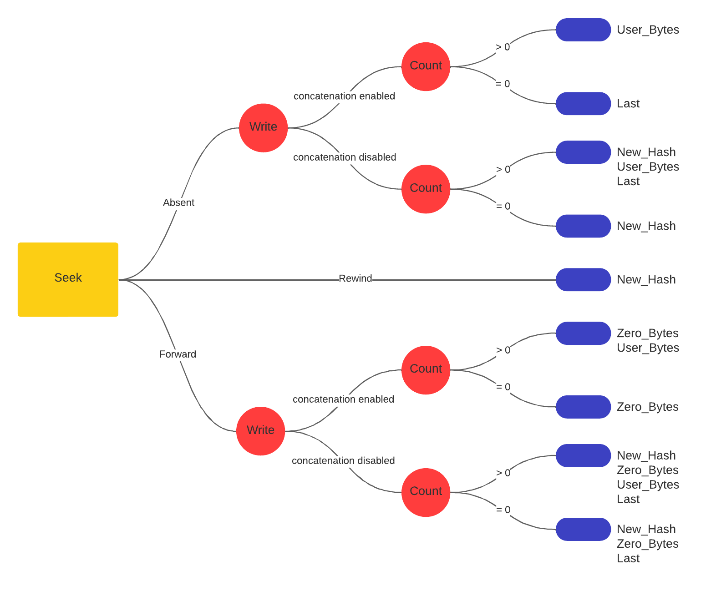

# SHA-256 Core Linux Driver on a ZYNQ APSoC 

  

Open access lab experience as an introduction to the development of Linux/FreeRTOS device drivers
for hardware accelerators.

The idea comes from the [EMNESS](https://emness.eu) initiative, with the goal to structure an
innovative academic curriculum on reliability and hardware security. The project is submitted as
part of the Operating System (04JEZOQ) exam at the Politecnico di Torino.

## Contributors

[Fabio Scatozza](mailto:s315216@studenti.polito.it),
[Isacco Delpero](mailto:s314713@studenti.polito.it>),
[Leonardo Cerruti](mailto:s317664@studenti.polito.it>),
[Claudio Capobianchi](mailto:s319187@studenti.polito.it>), 
[Saman Alipour](mailto:s307980@studenti.polito.it>),
[Abdul Rehman](mailto:s315198@studenti.polito.it>), and
[Stephano Perera](mailto:s313080@studenti.polito.it>)

## Project Advancement
* [X] Collect and organize material

* [ ] Platform design
    
    * [X] simple AXI4 Lite interconnection
   
    * [ ] AXI4 Stream + Lite interconnection to leverage stream-hashing capabilities of the crypto core
      
      *TODO* convert crypto core protocol to AXI4 Stream

* [X] Baremetal self-test

    * [X] polling synchronization
    
    * [X] interrupt synchronization

* [x] PetaLinux project

    * [ ] polling synchronization

      *TODO* improve polling in an efficient way (without sleeping for 1 ms)

    * [x] interrupt synchronization

* [X] Lab experience 
  
 

## Contents

<!-- @import "[TOC]" {cmd="toc" depthFrom=2 depthTo=6 orderedList=false} -->

<!-- code_chunk_output -->

- [Contributors](#contributors)
- [Project Advancement](#project-advancement)
- [Contents](#contents)
- [What is this?](#what-is-this)
- [Getting Started](#getting-started)
  - [Generating the Hardware Design](#generating-the-hardware-design)
  - [Baremetal Platform Test](#baremetal-platform-test)
  - [PetaLinux Flow](#petalinux-flow)
- [Deploy from Release](#deploy-from-release)
- [Usage (TUL PYNQ-Z2 board)](#usage-tul-pynq-z2-board)
- [The Lab Experience](#the-lab-experience)
  - [The algorithm](#the-algorithm)
  - [The Programmer's Model](#the-programmers-model)
  - [Exercises](#exercises)
    - [Exercise 1 - Testing all the driver functionalities](#exercise-1---testing-all-the-driver-functionalities)
    - [Exercise 2 - Checking the correctness of the digest from the crypto core](#exercise-2---checking-the-correctness-of-the-digest-from-the-crypto-core)
    - [Exercise 3 - TCP server](#exercise-3---tcp-server)
    - [Exercise 4 - File comparison using multithreading and semaphores](#exercise-4---file-comparison-using-multithreading-and-semaphores)
    - [Exercise 5 - Password finder from a hash](#exercise-5---password-finder-from-a-hash)
    - [Exercise 6 - Pipe secure comunication](#exercise-6---pipe-secure-comunication)
    - [Exercise 7 - Client and Server](#exercise-7---client-and-server)
    - [Exercise 8 - Possible attacks](#exercise-8---possible-attacks)
- [License](#license)
- [Sources](#sources)

<!-- /code_chunk_output -->

## What is this?
The aim of this lab experience is to work on an environment made of a processor and an external
hardware accelerator that implements the SHA 256 algorithm in an efficient way. The crypto core is
described in VHDL, so that it can be implemented on a FPGA. Some memory-mapped registers have been
designed: to make the system work, it is sufficient to connect these registers to processor bus and
to assign them proper addresses.

To develop the proposed exercises, it is required to install Linux operating system on the processor,
so that the external device can be accessed by using the device driver we developed. Some tools to
install Linux on a processing system can be easily found online. For example, if working on a Xilinx
board, Linux OS can be installed through PetaLinux tool. The exercises require the knowledge of the
main system programming methods on Linux (system calls, files management, shared memory, pipes, message
passing, threads, semaphores): to learn more about these topics you can find some useful material
in the provided sources. 

## Getting Started
The project targets the [TUL PYNQ-Z2](https://www.tulembedded.com/fpga/ProductsPYNQ-Z2.html) board,
but other all programmable SoC architectures can be used by adapting the flow according to the
vendor's documentation. The steps listed below guide you through the development steps,
from the design of the platform up to the compilation of the loadable kernel module.

To quickly setup the lab environment, download the latest release. Unpack it and jump to
[Deploy from Release](#deploy-from-release).

Before moving on, make sure to have the following tools available:

* Vivado and Vitis design environments
* Cable Drivers
* PetaLinux
* any Serial Communication Program of your choice

Detailed installation instructions are available in the [documentation portal][amd-doc]; for a
simple installation have a look at the AMD Unified Installer. Notice that on Windows, *Install Cable
Drivers* is an optional selection in the installer; for linux instead, a dedicated script is
provided within Vivado install directory. 

Then, run a clone:

    git clone https://github.com/fscatox/emness_sha256.git

and change into the newly created project directory:

    cd /path/to/emness_sha256

### Generating the Hardware Design
AMD hardware designs are created with Vivado and exported in the proprietary `xsa` file format,
which can then be used by both Vitis and PetaLinux. The process is automated with a TCL script; 
while in the root project directory, run:

    vivado -source scripts/main_vivado.tcl

The output is generated in the `out/` folder. Notice that the critical warnings concerning the 
`PCW_UIPARAM_DDR_DQS_TO_CLK_DELAY` parameters are hardware errata.

Inside [`src/ip/hdl`](src/ip/hdl) you can examine 
the RTL description of the open source crypto core retrieved from Jonny Doin's 
[project][sha256-core]. Although it's a stream hash engine, for simplicity it's wrapped as an 
AXI4 peripheral with a Lite interface: this is where the peripheral register file and the 
synchronization mechanisms are implemented. 

After having packaged the IP core, the platform is assembled by picking modules from the Vivado
catalogue and wrapped as the top entity. 

### Baremetal Platform Test
Before tackling the linux development problem, a simple baremetal driver and a self-test programs
are given in [`src/ip/api`](src/ip/api) to test the hardware platform.

1. Open Vitis and specify a workspace directory.

2. Create a *New Application Project* and choose the tab for creating a new platform from hardware,
   namely `out/EmnessSha256.xsa`. Keep the default selection to generate the boot components

   

     
   

3. Enter a name for the project and keep the default selection of a single target processor core.

4. Pick the *Empty Application (C)* and finish the wizard.

5. In the *Explorer* tab, under `<project-name>_system/<project-name>` right click on `src` and
   select *Import Sources*
   
   

     
   

6. In the *Assistant* tab, select the `<project-name>_system` entry and hit *Run*. The expected
   output is: 
       
        ################################
        # gv_sha256 self test
        # NIST-ADDITIONAL-SHA256: n. 7
        ################################

        Starting polling test...

        Hash: D29751F2_649B32FF_572B5E0A_9F541EA6_60A50F94_FF0BEEDF_B0B692B9_24CC8025

        Test passed...

        ################################

        Starting interrupt test...

        Configuration done...

        Hash: D29751F2_649B32FF_572B5E0A_9F541EA6_60A50F94_FF0BEEDF_B0B692B9_24CC8025

        Test passed...

### PetaLinux Flow
The PetaLinux flow is extensively documented in the reference guide [UG1144][amd-doc]. The steps for
a custom hardware platform are summarized in the table below.

| Design Step | Tool |
| ----------- | ---- |
| Create a PetaLinux project | `petalinux-create -t project` |
| Initialize a PetaLinux project (for custom hardware only) | `petalinux-config--get-hw-description` |
| Configure the Linux kernel | `petalinux-config -c kernel` |
| Configure the root filesystem | `petalinux-config -c rootfs` |
| Create user components | `petalinux-create -t COMPONENT` |
| Build the system | `petalinux-build` |
| Package for deploying the system | `petalinux-package` |

1. Setup PetaLinux environment

       source <petaLinux_tool_install_dir>/settings.sh

2. Starting from the project root directory, create a PetaLinux project for custom hardware 

        petalinux-create --type project --template zynq --name sha256peta
        cd sha256peta
        petalinux-config --get-hw-description ../out/EmnessSha256.xsa

   A configuration menu opens. To make the root file system retain changes and to enable maximum
   usage of available DDR memory, we are using the EXT4 format for a separate rootfs partition, and
   FAT32 in the boot partition. 

   *→ DTG Settings → Kernel Bootargs*:
     * change *generate boot args automatically* to NO
     * update *user set kernel bootargs* to 
         
           earlycon console=ttyPS0,115200 clk_ignore_unused root=/dev/mmcblk0p2 rw rootwait cma=512M
         
   *→ Image Packaging Configuration*:
     * change *root filesystem type* to EXT4

3. Customize the kernel by launching:
       
       petalinux-config -c kernel

   *→ CPU Power Management*: CPU IDLE causes the processors to get into IDLE state when the processor
   is not in use. During project development it can be disabled to avoid interactions with debug
   subsystems. 
     * change *CPU Frequency scaling* to NO
     * change *CPU Idle* to NO

   *→ Device Drivers*:
     * change *On-Chip Interconnect management support* to YES

     * *→ Reset Controller Support*:
       * change *Simple Reset Controller Driver* to YES

     * *→ Userspace I/O drivers*:
       * change *Userspace I/O platform driver with generic IRQ handling* to YES
       * change *Userspace platform driver with generic irq and dynamic memory* to YES
       * change *Xilinx AI Engine driver* to YES

4. Customize the root file system by launching:

       petalinux-config -c rootfs

   *→ Filesystem Packages → misc → packagegroup-core-buildessential*: to include basic development
   tools, such as `gcc`:
     * change *packagegroup-core-buildessential* to YES
     * change *packagegroup-core-buildessential-dev* to YES

   *→ Filesystem Packages → console → network → openssh*: to provide network access to the board:
     * change *openssh* to YES
     * change *openssh-sshd* to YES
     * change *openssh-sftp-server* to YES
     * change *openssh-scp* to YES

   *→ Image Features*: 
     * change *package-management* to YES
     * change *debug-tweaks* to YES

5. Build the system by launching:

       petalinux-build

6. Customize the device tree. In your favorite text editor, starting from PetaLinux project root, open:
      
       components/plnx_workspace/device-tree/device-tree/pl.dtsi 

   If the `interrupts` attribute line is:
     
       interrupts = <0 29 4>;

   a further step is needed to change the sensitivity to *rising edge*, encoded in the last of the
   three numbers. Starting from PetaLinux project root, open:

       /project-spec/meta-user/recipes-bsp/device-tree/files/system-user.dtsi
   
   then, paste the `amba_pl` node description from `components/plnx_workspace/device-tree/device-tree/pl.dtsi`
   and change the `interrupts` attribute line to:
      
       interrupts = <0 29 1>; 
   
   Then rebuild the device tree and the entire system:

        petalinux-build -c device-tree
        petalinux-build

   If you want to make sure that the changes was applied, starting from the PetaLinux project root change to:
     
        images/linux

   Then extract the device tree:
  
        dumpimage -T flat_dt -p 1 -o device_tree_out.dtb image.ub

   and de-compile it in a human-readable format:
 
        dtc -I dtb -O dts -o device_tree_out.dts device_tree_out.dtb
   
   Finally, you can open `device_tree_out.dts` and locate the `amba_pl` device node.

7. Create the custom kernel module by launching:

       petalinux-create -t modules --name sha256

   Starting from PetaLinux project root, change to the newly created module directory:

       cd project-spec/meta-user/recipes-modules/sha256

   To cross-compile the kernel module, first copy the provided module sources:
    
        cp ../../../../../src/lkm/sha256* ./files

   Then, edit the bitbake recipe `./sha256.bb` by changing:
       
        SRC_URI = "file://Makefile \
                   file://sha256.c \
                   file://COPYING \
                  "
   into:
       
        SRC_URI = "file://Makefile \
                   file://sha256.c \
                   file://sha256.h \
                   file://COPYING \
                  "

   Finally, launch:

        petalinux-build -c sha256

   The compiled module is located somewhere within the PetaLinux folder; from the PetaLinux project root

        find -name "sha256.ko"

   should tell you exactly where.

9. Package for deploying the system. The preliminary step is to partition the SD card:

     * ~ 200 MB for the FAT32 bootable partition

     * the remaining space as EXT4 root file system partition

   Feel free to use any tool you'd like, the [UG1144][amd-doc] manual suggests a procedure
   employing `fdisk`. 

   To generate the files suitable to deployment from SD card, from the PetaLinux project root change
   into:

       images/linux/

   run:
       
       petalinux-package --boot --fsbl zynq_fsbl.elf --fpga system.bit --u-boot --force

   Then:
     * copy `BOOT.BIN`, `image.ub`, and `boot.scr` to the bootable partition
     * extract `rootfs.tar.gz` to the root file system partition; assuming the partition is mounted
       in `/media/rootfs`, the command would be:
           
           sudo tar xvfp rootfs.tar.gz -C /media/rootfs
     * copy the module to `/media/rootfs/home/root`. You will have it available when booting up the
       system.  

## Deploy from Release
As a preliminary step, partition the SD card with the following scheme:
* ~ 200 MB for the FAT32 bootable partition
* the remaining space as EXT4 root file system partition

Feel free to use any tool you'd like, the [UG1144][amd-doc] manual suggests a procedure
employing `fdisk`. 

After having downloaded the release, unpack it and then:
* copy `BOOT.BIN`, `image.ub`, and `boot.scr` to the bootable partition
* extract `rootfs.tar.gz` to the root file system partition; assuming the partition is mounted
  in `/media/rootfs`, the command would be:
    
      sudo tar xvfp rootfs.tar.gz -C /media/rootfs

## Usage (TUL PYNQ-Z2 board)
Access to the board is made possible through serial port or SSH. The former through a usb port
(USB protocol is converted to serial one thanks to FTDI FT2232HQ chip), the latter an ethernet
one and allows multiple remote connections; during our tests we used a point-to-point connection.
Pick a tool depending on your needs; `picocom` and `PuTTY` are quite popular choices.

Serial terminal settings:
* Port: depends on remote system, command `ls /dev` shows the available devices, the board is 
  usually `/dev/ttyUSBx`
* Baud rate:      115200
* Data bits:      8
* Stop bits:      1
* Partity check:  none
* Flow control:   none

Once the serial connection is established, a command prompt appears: if you set up the system 
using the published release, enter both user and password as `root`. You will find both the
self test program and the compiled kernel module in the root folder.

To load the kernel module from the root folder:
* `insmod sha256.ko` loads the module automatically selecting interrupt synchronization.
* `insmod sha256.ko irq_enable=n` loads the module selecting polling synchronization.

SSH settings:
* IP:             Board IP address
* Port:           22
* User:           root
* Password:       root

## The Lab Experience
Now it's your turn! Read the next sections then dive into the exercises. Strive to devise
efficient, elegant and innovative solutions and if feel stuck, have a look at
[`solutions`](solutions).

### The algorithm
The algorithm is the SHA-256 (Secure Hash Algorithm 256), one of the cryptographic hash functions designed
by the United States National Security Agency (NSA). All the SHA algorithms work in a similar way: they
take as input a message of indefinite length (for example, a file content) and they deliver as output a
digest (or hash) on a fixed number of bytes. The input message is divided into blocks and each block is then
divided into words. SHA-256 requires blocks of 512 bits (64 bytes), divided into 16 32-bit words. The message
length (on 64 bits) is appended at the end of the message (thus the maximum length of the message is equal to
$2^{64}$ bits, which is a really big size, unreachable from a practical point of view). Between the message and
the length a ‘1’ bit is added followed by as many zeros as needed to have an overall message with a length equal
to a multiple of 512 bits.

The hash is on 256 bits (32 bytes), divided into 8 32-bit words. One message block at a time is sent to the
algorithm: the hash computed for each block is used as the starting point to compute the hash for the following
block. The hash for the first block is computed starting from an initial hash, defined by the algorithm standard
(it is obtained by taking the first 32 bits of the fractional parts of the square root of the first 8 prime
numbers). After last block is read, the algorithm provides the final hash.

Cryptographic functions like the SHA-256 can be used for a lot of applications, for example to verify the integrity
of a message or file, to verify the correctness of a password or to reliably identify a file. They are called
secure because, for a given algorithm, it is computationally infeasible:
 * to find a message that corresponds to a given message digest, or
 * to find two different messages that produce the same message digest. 

To learn more about how the algorithm is implemented it is suggested to have a look
to the [algorithm standard](http://dx.doi.org/10.6028/NIST.FIPS.180-4).

  

### The Programmer's Model

If programming in a bare metal environment, the accelerator must be accessed through the following
memory-mapped registers: CSR is the control & status register, WXX registers are used to store
the 512-bit block, while HX registers store the computed digest.

| Register Name | Bit Field and Description          |
|---------------|------------------------------------|
| CSR           | <table><thead><tr><th>31</th><th>30</th><th>29</th><th>10</th><th>9</th><th>8</th><th>7:4</th><th>3:2</th><th>1</th><th>0</th></tr></thead><tbody><tr><td>ERR</td><td>DONE</td><td>BLOCKREAD</td><td>IENABLE</td><td>WR</td><td>LAST</td><td>LASTWORD</td><td>VALIDBYTE</td><td>NEWHASH</td><td>COREENABLE</td></tr></tbody></table>ERR: read-only bit raised by the crypto core if some error occurs. DONE: read-only bit raised by the crypto core when the hash computation of the entire message has terminated. BLOCKREAD: read-only bit raised by the crypto core when an entire block has been read (it is not raised if the block is the last one); it is automatically cleared when writing '1' on WR. IENABLE: this bit must be set by the programmer if he wants to use interrupts. WR: this bit must be set to '1' to tell the core that a new block is available in the registers; it is automatically cleared after all the words have been read by the core. LAST: this bit must be set by the programmer before writing '1' on WR to indicate that the block the core is going to read is the last one; it is automatically cleared when writing '1' on NEWHASH. LASTWORD: 4 bits to indicate $N_{words}-1$, where $N_{words}$ is the number of valid words inside the block. VALIDBYTE: 2 bits to indicate how many bytes are part of the message in last word ("00" if all bytes are valid). NEWHASH: this bit must be set before starting the computation of a new hash to reset the crypto core; it is automatically cleared after one clock cycle. COREENABLE: this bit must be set to enable the crypto core.
| WXX           | W0: most significant word of the 512-bit block  W15: least significant word of the 512 bit block. 
| HX            | H7: most significant word of the 256-bit hash  H0: least significant word of the 256-bit hash

If programming in a Linux environment, there is no need of knowing the registers:
the driver provides all the functionalities to compute the hash of a message or
a concatenation of more messages. Like all device drivers in Linux, it is sufficient
to use some system calls:
* open(): it enables the core.
* close(): it disables the core.
* ioctl(): to choose between concatenated (writing 1) or non-concatenated mode.
 (writing 0). Please notice that it is important to always specify the desired behaviour,
 there is no guarantee that at the beginning non-concatenated mode is active.
* lseek(): allows to reset the core (if final position == 0) or to add some bytes filled
 with 0s (if final position > current position).
* write(): to send the message from which the hash must be computed. Writing a number
 of bytes equal to 0 allows some special functionalities (summarized in the graph).
* read(): to read the computed hash; if this system call is invoked while the core is still
 computing the hash, it waits until the result is available (unless O_NONBLOCK was set while
 opening the file).

The following graph summarize how to use the system calls to send the message to the core, in both
concatenated and non-concatenated mode.

### Exercises

#### Exercise 1 - Testing all the driver functionalities
Objective:

Develop a C program to perform a comprehensive self-test for a driver implementing the
SHA256 hashing algorithm. The self-test program should rigorously validate the correctness
and integrity of the SHA256 hashing algorithm under various scenarios, ensuring its
robustness and reliability.

Test Functions:

Write: This is the basic instruction, where a word is written and a hash is read back.

Concatenation: This test function will focus on testing the concatenation functionality of
the SHA256 driver. It will write multiple data blocks to the driver and verify the resulting
hash values. This test ensures that the SHA256 algorithm handles the concatenation of data
correctly and produces accurate hash outputs.

With_Seek: The With_Seek test function will evaluate the SHA256 driver's behavior when
performing forward seeks in the data stream. It will write data blocks with forward seeks
to different positions in the source file, validating the hash values at each seek position.
Forward seek will result in a 0 padding while backward seed (rewind) will work as reset and
generate the new_hash signal.
This test ensures that the SHA256 algorithm can handle data writes with seeks accurately.

Without_Seek: The Without_Seek test function will verify the SHA256 driver's capability to
handle data writes without seeks. It will write data blocks sequentially without any seeks,
ensuring the integrity of the hashing algorithm under continuous data input scenarios.

Multi-Threading and Mutex:

To ensure accurate and synchronized execution of the self-test process, the program will
utilize multi-threading with pthread library. Specifically, the program will create three
threads, each executing one of the three test functions (concatenation, With_Seek, and
Without_Seek). The purpose of multi-threading is to parallelize the self-test, allowing
simultaneous testing of different aspects of the SHA256 driver, which can significantly
speed up the overall self-test process.

A pthread_mutex_t variable named mutex will be used to implement mutual exclusion. The mutex
will act as a synchronization mechanism to prevent potential data races and ensure that each
test function executes exclusively without interfering with the others. Before executing a
test function, the corresponding thread will lock the mutex using pthread_mutex_lock,
ensuring exclusive access. Once the test function completes, the thread will unlock the
mutex using pthread_mutex_unlock, allowing the next thread to proceed.

Explanation:

The purpose of the self-test program is to validate the correct implementation and
functionality of the SHA256 driver. By running the test functions under different scenarios
and comparing the generated hash values with precomputed hash values, the program can
ensure that the SHA256 algorithm produces consistent and accurate results.

Multi-threading enhances the efficiency of the self-test process by concurrently executing
the test functions. Each thread independently tests a specific aspect of the SHA256 driver,
leading to a faster overall self-test. The mutex ensures that each test function executes
atomically without interference, preventing race conditions and guaranteeing the reliability
of the test results.
#### Exercise 2 - Checking the correctness of the digest from the crypto core

Write a C program that computes the hash of a file in two different ways: by using the accelerator
and by using Linux command "sha256sum". The file is of unknown size, so dynamic memory allocation must be used
while reading it. After having stored the file content into a buffer, a fork() system call must be executed: the
child process must invoke "sha256sum" command through a execl() system call (and redirect the output to a file
named hash.txt), whereas the parent process must access the external crypto core and then wait for the child
termination. Then the two hashes are read and compared: a success (if they are equal) or failure (if they are
different) message must be printed on the screen. Finally, hash.txt file must be removed by invoking "rm" Linux
command through system() system call.
 
#### Exercise 3 - TCP server
Develop a program that constructs a TCP server using the socket system call. 
A TCP server is a type of network server that uses the TCP protocol for communication. 
TCP is one of the core protocols of the Internet Protocol Suite and provides reliable, 
ordered, and error-checked delivery of data between networked devices.

The socket system call allows the program to establish a communication endpoint, commonly
known as a socket, that can send and receive data over a network.

The program should accept the number of clients as a parameter and be capable of 
concurrently handling multiple clients using multithreading.
Each client's thread should wait for a termination message; otherwise, it should listen
for client input. 
There is no timeout set for each client's connection.

Additionally, the program should provide the following functionalities for a shared folder
on the server:

- List Directories: Use the "ls" command to retrieve a list of directories inside the shared
 folder.

- Make Directory: Utilize the "system" system call "mkdir" to create a new directory within
the shared folder.

- Download Content: Enable the download of text file contents while verifying its integrity
using the SHA256 checksum. for the SHA256 you have to use the core through driver. 
This functionality should utilize two separate threads: one for reading the file's content
and another for calculating the hash. The second thread should execute after the first one,
 and synchronization should be achieved using a semaphore.

To prevent concurrent access to files in the shared folder by multiple clients, employ a
mutex and also use mutex to prevent multiple access to the crypto core.

#### Exercise 4 - File comparison using multithreading and semaphores
Write a program that receives a list of files as input from command line (The number of files
shouldn't be specified "a priori") and checks that they are equal.
In particular the program must generate multiple threads (one for each file), that
open the files, calculate the hashes using the provided hardware accellerator and returns it.
Notice that the device is one, so the threads must have a semaphore to decide when to 
calculate the hash.
Try to use the write with concatenation function for sending the files' content to the core.
The hash comparison can be done in the main.

Improvement: Try to keep everything generic and consider all input lenghts unknown

#### Exercise 5 - Password finder from a hash
Write a program who tries to find the correct password, recognising it from the
expected hash. This program must read a list of password attempts from a file and the
expected hash from another file, both given by command line. It then creates multiple
threads (one per password attempt). Each thread calculates the hash of one password attempt
using the device driver (/dev/sha256) and compares the calculated hash with the expected one.
The program must then return the original password.

Hint: use the return values of the threads.

#### Exercise 6 - Pipe secure comunication
Objective:

The objective of this C program is to demonstrate secure communication between parent and
child processes using a named pipe ('aPipe') and custom SHA-256 hashing for data integrity
verification. The program aims to establish a secure communication channel between the
parent and child processes, ensuring that data is transmitted accurately.

Explanation:
1. Named Pipe Creation: The program begins by creating a named pipe using the mkfifo() function. The named pipe is used for interprocess communication between the parent and child processes.
2. Parent Process:
   User Input: The parent process prompts the user to enter a message.
   Write to Pipe: The entered message is then sent to the child process through the named pipe using the write() function.
3. Child Process:
   Read from Pipe: The child process reads the message sent by the parent processfrom the named pipe using the read() function.
   SHA-256 Hash Calculation: A custom SHA-256 implementation is used to calculate the SHA-256 hash of the received message.
   Write Hash to Pipe: The calculated hash is sent back to the parent process through the named pipe using the write() function.
4. Parent Process (Continued):
   Read Hash from Pipe: The parent process reads the received hash from the named pipe using the read() function.
   SHA-256 Hash Verification: The program calculates the SHA-256 hash of the original message entered by the user.
   Data Integrity Check: The received hash is compared with the expected hash.
   If they match, data integrity is verified, and a success message is displayed otherwise, a failure message is shown.
5. Error Handling: The program handles various potential errors, such as pipe creation failure, read/write errors, and hash calculation errors. Proper error messages are displayed to the user.
6. Secure Communication: The program adheres to best practices for secure communication by using appropriate permissions for the named pipe and ensuring secure data transmission between the parent and child processes.
By accomplishing these objectives, the program exemplifies a secure communication mechanism between parent and child processes, ensuring the integrity of transmitted data using custom SHA-256 hashing.

#### Exercise 7 - Client and Server
In order to simulate a login operation write two C programs, representing server and client. The former waits for email and password given by the client and after having verified that email is present in a pre-formed database, calculates the hash of the password and compare it with the other hashes in the database. The latter waits instead for server response, which can be "email not found", "wrong password" or "access granted". Enrich server capabilities using an arbitrary number of threads which represent the maximum number contemporary login attempts to the server. Simulate that using multiple executions of the same client executable file. Remember that in the server is present only one crypto core. (Hint: execute server first and then use different thread id as client argument for every client instantiation).

#### Exercise 8 - Possible attacks
Objective: try to get the driver not working

Approach 1: Can you think of any pitfall related to `SHA256_IOC_WCAT` command?

Approach 2: Try to develop a non working version of the driver starting from the original version. The hacked version of the hash driver should not generate any error such that the user doesn't get warned but just get wrong hash results.

Hint: Try to modify the read or write function of the driver in order to make wrong data.

## License

Code: [GNU GPLv3](https://choosealicense.com/licenses/gpl-3.0/)

Documentation: [CC BY-NC 4.0](http://creativecommons.org/licenses/by-nc/4.0/)

## Sources
[Hash Functions][hash-functions] -

[Secure Hash Standard][sh-standard] -

[SHA-256 Core][sha256-core] - 

[AMD Documentation Portal][amd-doc] - 

[OS Concepts][os-concepts] -

[//]: # "Source definitions"
[hash-functions]: https://csrc.nist.gov/projects/hash-functions "Hash Functions by NIST CSRC"
[sh-standard]: http://dx.doi.org/10.6028/NIST.FIPS.180-4 "FIPS PUB 180-4 Secure Hash Standard"
[sha256-core]: https://opencores.org/projects/sha256_hash_core "SHA-256 HASH CORE"
[amd-doc]: https://docs.xilinx.com/ "AMD Documentation Portal"
[os-concepts]: https://www.os-book.com/OS10/ "Operating System Concepts"

