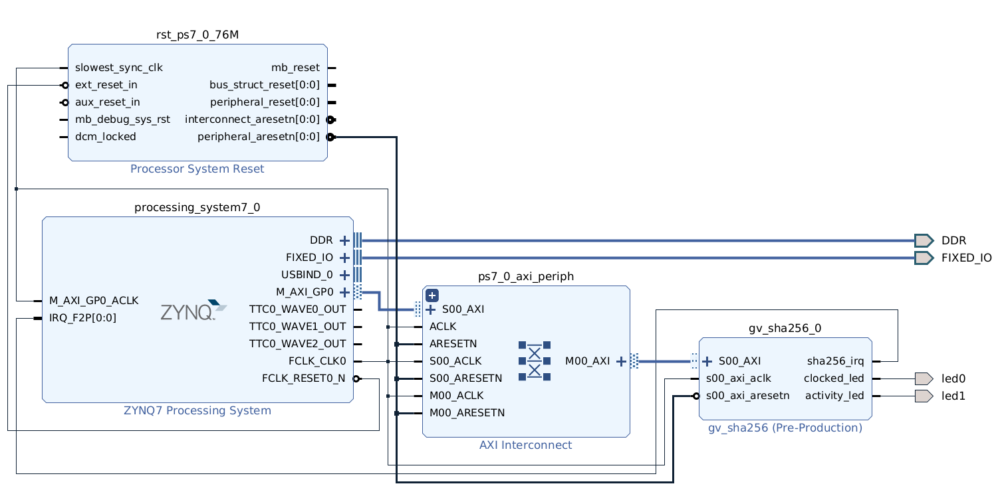
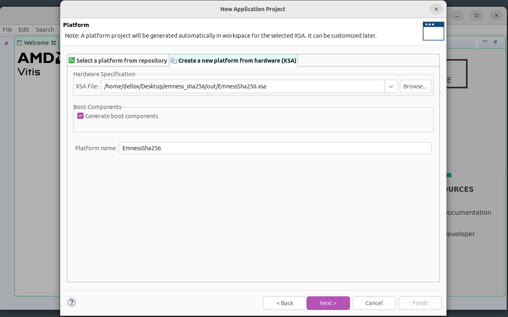
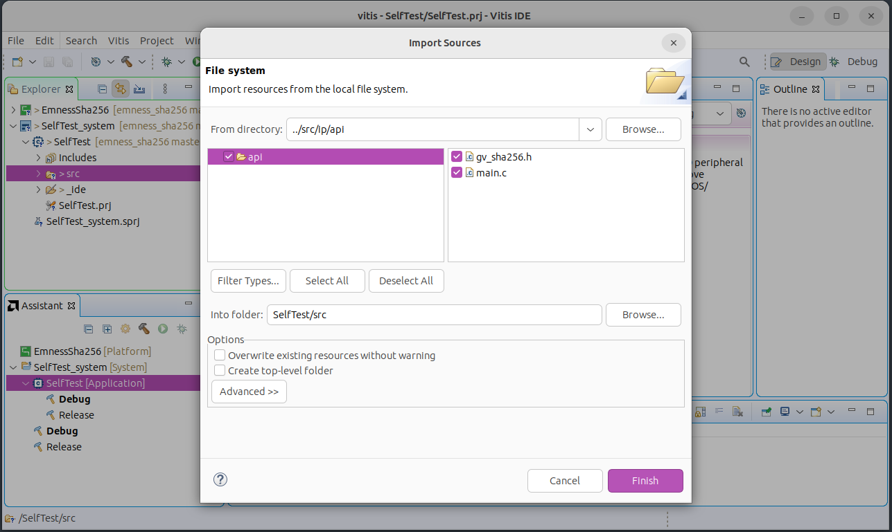
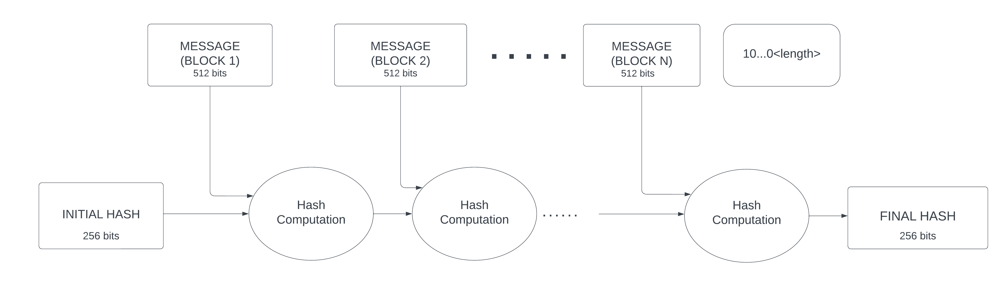

# SHA-256 Core Linux Driver on a ZYNQ APSoC 

Open access lab experience as an introduction to the development of
Linux/FreeRTOS device drivers for hardware accelerators.

The idea comes from the [EMNESS](https://emness.eu) initiative, with the goal
of structuring innovative academic curricula on reliability and hardware
security.

  

## Contents

* [What is this?](#what-is-this)

* [Getting started](#getting-started)

    * [Generating the Hardware Design](#generating-the-hardware-design)

    * [Baremetal Platform Test](#baremetal-platform-test)

    * [PetaLinux Flow](#petalinux-flow)

* [Exercises](#exercises)

    * [Exercise 1](#exercise-1)

* [License](#license)

* [Sources](#sources)

* [Conclusion](#conclusion)

## What is this?
The aim of this lab experience is to work on an environment made of a processor and an external
hardware accelerator that implements the SHA 256 algorithm in an efficient way. The crypto core is
described in VHDL, so that it can be implemented on a FPGA. Some memory-mapped registers have been
designed: to make the system work, it is sufficient to connect these registers to processor bus and
to assign them proper addresses.

To develop the proposed exercises, it is required to install Linux operating system on the processor,
so that the external device can be accessed by using the device driver we developed. Some tools to
install Linux on a processing system can be easily found online. For example, if working on a Xilinx
board, Linux OS can be installed through Petalinux tool. The exercises require the knowledge of the
main system programming methods on Linux (system calls, files management, shared memory, message
passing, threads, semaphores): to learn more about these topics you can find some useful material
in the provided sources. 

## Getting Started
The project targets the [TUL PYNQ-Z2](https://www.tulembedded.com/fpga/ProductsPYNQ-Z2.html) board,
but other all programmable SoC architectures can be used by adapting the flow according to the
vendor's documentation. The steps listed below quickly guide you through the preliminary steps,
from the design of the platform up to the compilation of the loadable kernel module.

Before moving on, make sure to have the following tools available:

* Vivado and Vitis design environments
* Cable Drivers
* PetaLinux
* any Serial Communication Program of your choice

Detailed installation instructions are available in the [documentation portal][amd-doc]; for a
simple installation have a look at the AMD Unified Installer. Notice that on Windows, *Install Cable
Drivers* is an optional selection in the installer; for linux instead, a dedicated script is
provided within Vivado install directory. 

Then, run a clone:

    git clone https://github.com/fscatox/emness_sha256.git

and change into the newly created preject directory:

    cd /path/to/emness_sha256

### Generating the Hardware Design
AMD hardware designs are created with Vivado and exported in the proprietary `xsa` file format,
which can then be used by both Vitis and PetaLinux. The process is automated with a TCL script; 
while in the root project directory, run:

    vivado -source scripts/main_vivado.tcl

The output is generated in the `out/` folder. Notice that the critical warnings concerning the 
`PCW_UIPARAM_DDR_DQS_TO_CLK_DELAY` parameters are hardware errata.

Inside [`src/ip/hdl`](src/ip/hdl) you can examine 
the RTL description of the open source crypto core retrieved from Jonny Doin's 
[project][sha256-core]. Altough it's a stream hash engine, for simplicity it's wrapped as an 
AXI4 peripheral with a Lite interface: this is where the peripheral register file and the 
synchronization mechanisms are implemented. 

After having packaged the IP core, the platform is assembled by picking modules from the Vivado
catalogue and wrapped as the top entity. 

### Baremetal Platform Test
Before tackling the linux development problem, a simple baremetal driver and a self-test programs
are given in [`src/ip/api`](src/ip/api) to test the hardware platform.

1. Open Vitis and specify a workspace directory.

2. Create a *New Application Project* and choose the tab for creating a new platform from hardware,
   namely `out/EmnessSha256.xsa`. Keep the default selection to generate the boot components

   

     
   

3. Enter a name for the project and keep the default selection of a single target processor core.

4. Pick the *Empty Application (C)* and finish the wizard.

5. In the *Explorer* tab, under `<project-name>_system/<project-name>` right click on `src` and
   select *Import Sources*
   
   

     
   

6. In the *Assistant* tab, select the `<project-name>_system` entry and hit *Run*.

### PetaLinux Flow
The PetaLinux flow is extensively documented in the reference guide [UG1144][amd-doc]. The steps for
a custom hardware platform are summarized in the table below.

| Design Step | Tool |
| ----------- | ---- |
| Create a PetaLinux project | `petalinux-create -t project` |
| Initialize a PetaLinux project (for custom hardware only) | `petalinux-config--get-hw-description` |
| Configure the Linux kernel | `petalinux-config -c kernel` |
| Configure the root filesystem | `petalinux-config -c rootfs` |
| Create user components | `petalinux-create -t COMPONENT` |
| Build the system | `petalinux-build` |
| Package for deploying the system | `petalinux-package` |

1. Setup PetaLinux environment

       source <petaLinux_tool_install_dir>/settings.sh

2. Starting from the project root directory, create a PetaLinux project for custom hardware 

        petalinux-create --type project --template zynq --name sha256peta
        cd sha256peta
        petalinux-config --get-hw-description ../out/EmnessSha256.xsa

   A configuration menu opens. To make the root file system retain changes and to enable maximum
   usage of available DDR memory, we are using the EXT4 format for a separate rootfs partition, and
   FAT32 in the boot partition. 

   *→ DTG Settings → Kernel Bootargs*:
     * change *generate boot args automatically* to NO
     * update *user set kernel bootargs* to 
         
           earlycon console=ttyPS0,115200 clk_ignore_unused root=/dev/mmcblk0p2 rw rootwait cma=512M
         
   *→ Image Packaging Configuration*:
     * change *root filesystem type* to EXT4

3. Customize the kernel by launching:
       
       petalinux-config -c kernel

   *→ CPU Power Management*: CPU IDLE causes the processors to get into IDLE state when the processor
   is not in use. During project development it can be disabled to avoid interactions with debug
   subsystems. 
     * change *CPU Frequency scaling* to NO
     * change *CPU Idle* to NO

   *→ Device Drivers → Userspace I/O drivers*:
     * change *Userspace platform driver with generic irq and dynamic memory* to YES

4. Customize the root file system by launching:

       petalinux-config -c rootfs

   *→ Filesystem Packages → misc → packagegroup-core-buildessential*: to include basic development
   tools, such as `gcc`:
     * change *packagegroup-core-buildessential* to YES
     * change *packagegroup-core-buildessential-dev* to YES

   *→ Filesystem Packages → console → network → openssh*: to provide network access to the board:
     * change *openssh* to YES
     * change *openssh-sshd* to YES
     * change *openssh-sftp-server* to YES
     * change *openssh-scp* to YES

   *→ Image Features*: 
     * change *package-management* to YES
     * change *debug-tweaks* to YES

5. Create and add the custom kernel module by launching:

       petalinux-create -t modules --name sha256 --enable

   Starting from project root, change to the newly created module directory:

       cd project-spec/meta-user/recipes-modules/sha256

6. Build the system by launching:

       petalinux-build

7. Customize the device tree. In your favorite text editor, starting from project root, open:
      
       components/plnx_workspace/device-tree/device-tree/pl.dtsi 

   If the `interrupts` attribute line is:
     
       interrupts = <0 29 4>;

   a further step is needed to change the sensitivity to *rising edge*, encoded in the last of the
   three numbers. Change the line to:
      
       interrupts = <0 29 1>; 
   
   Then rebuild the device tree and the entire system:

        petalinux-build -c device-tree
        petalinux-build

   If you want to make sure that the changes was applied, starting from the proect root change to:
     
        images/linux

   Then extract the device tree:
  
        dumpimage -T flat_dt -p 1 -o device_tree_out.dtb image.ub

   and de-compile it in a human-readable format:
 
        dtc -I dtb -O dts -o device_tree_out.dts device_tree_out.dtb
   
   Finally, you can open `device_tree_out.dts` and locate the `amba_pl` device node.

8. To cross-compile the kernel module, starting from the proect root, change to:
       
        project-spec/meta-user/recipes-modules/sha256

   First, copy the provided module sources:
    
        cp ../../../../../../src/lkm/sha256* ./files

   Then, edit the bitbake recipe `./sha256.bb` by changing:
       
        SRC_URI = "file://Makefile \
                   file://sha256.c \
                   file://COPYING \
                  "
   into:
       
        SRC_URI = "file://Makefile \
                   file://sha256.c \
                   file://sha256.h \
                   file://COPYING \
                  "
9. 

## The algorithm
Before presenting the exercises, let's make an overview of the algorithm implemented in the crypto core,
 so that everybody can understand what we are performing. 

The algorithm is the SHA-256 (Secure Hash Algorithm 256), one of the cryptographic hash functions designed
by the United States National Security Agency (NSA). All the SHA algorithms work in a similar way: they
take as input a message of indefinite length (for example, a file content) and they deliver as output a
digest (or hash) on a fixed number of bytes. The input message is divided into blocks and each block is then
divided into words. SHA-256 requires blocks of 512 bits (64 bytes), divided into 16 32-bit words. Some bits
are added at the end of the message: the bit '1' is always appended, followed by some zeros, finally the lenght
of the message (without the additional 1 and 0s) is expressed on 64 bits (thus the maximum length of the message
is equal to $2^{64}$ bits, which is a really big size, unreachable from a practical point of view). The zeros
between the '1' and the message length are added in order to have a padded message with a length equal to a
multiple of 512 bits.

The hash is on 256 bits (32 bytes), divided into 8 32-bit words. One message block at a time is sent to the
algorithm: the hash computed for each block is used as the starting point to compute the hash for the following
block. The hash for the first block is computed starting from an initial hash, defined by the algorithm standard
(it is obtained by taking the first 32 bits of the fractional parts of the square root of the first 8 prime
numbers). After last block is read, the algorithm provides the final hash.

Cryptographic functions like the SHA-256 can be used for a lot of applications, for example to verify the integrity
of a message or file, to verify the correctness of a password or to reliably identify a file. The key feature that
makes the use of SHA algorithms so widespread is that it is almost impossible to get the initial message starting
from the digest (the only way is to try out a lot of input messages until the desired hash is found).

To learn more about how the algorithm is implemented it is suggested to have a look
to the [algorithm standard](http://dx.doi.org/10.6028/NIST.FIPS.180-4).

  

## License

[GNU GPLv3](https://choosealicense.com/licenses/gpl-3.0/)

## Sources
[Hash Functions][hash-functions] -

[Secure Hash Standard][sh-standard] -

[SHA-256 Core][sha256-core] - 

[AMD Documentation Portal][amd-doc] - 

[//]: # "Source definitions"
[hash-functions]: https://csrc.nist.gov/projects/hash-functions "Hash Functions by NIST CSRC"
[sh-standard]: http://dx.doi.org/10.6028/NIST.FIPS.180-4 "FIPS PUB 180-4 Secure Hash Standard"
[sha256-core]: https://opencores.org/projects/sha256_hash_core "SHA-256 HASH CORE"
[amd-doc]: https://docs.xilinx.com/ "AMD Documentation Portal"
[os-concepts]: https://www.os-book.com/OS10/ "Operating System Concepts"

## Conclusion

